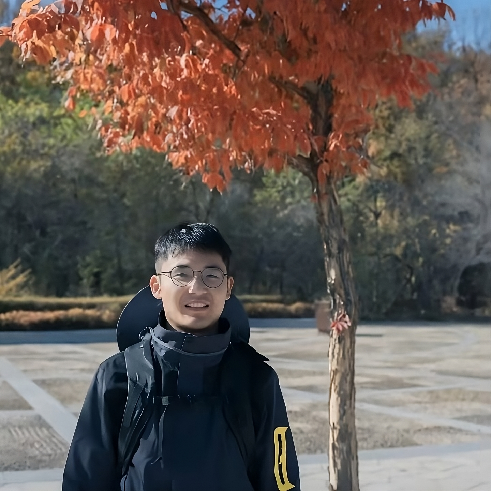

  
  

    Master Student  
    East China Normal University, China  
    <strong>E-mail</strong>: <a href="mailto:xry@stu.ecnu.edu.cn">xry@stu.ecnu.edu.cn</a>  
    Address: Room 607, Dishui Lake Building
  

---

Ruiyang Xu is a first-year master's student supervised by [Prof. Ting Su](https://tingsu.github.io/) at East China Normal University. His research interests include but not limited to programming languages, compilers, program analysis, and testing.

# Education

- Sep 2024 - Present. Master Degree in Software Engineering, [East China Normal University](https://english.ecnu.edu.cn/)  
- Sep 2020 - Jul 2024. Bachelor Degree in Software Engineering, [JiLin University](https://www.jlu.edu.cn/#)  

# Conference Papers

- **IFSE: Taming Closed-box Functions in Symbolic Execution via Fuzz Solving**
  - Qichang Wang, Chuyang Chen (Co-first author), **Ruiyang Xu**, Haiying Sun, Chengcheng Wan, Ting Su
  - [ICSE Demonstrations](https://conf.researchr.org/track/icse-2025/icse-2025-demonstrations) (under review), [Source Repository](https://github.com/ecnusse/ifse), [Presentation Video](https://youtu.be/xMv6_MOlE-I).

# Work Experience

- May 2023- May 2024. Huawei Research Project ("Slicing Code Simulation Verification Technology")  
  - Working on symbolic execution, fuzzing and SMT solvers

- Sep 2024 - Present. Teaching Assistant in [Software Analysis, Testing and Verification](https://github.com/ecnu-sa-labs/ecnu-sa-labs)

# Blog

Please see the [table of contents](./blog/) for an overview of all my blog posts.

